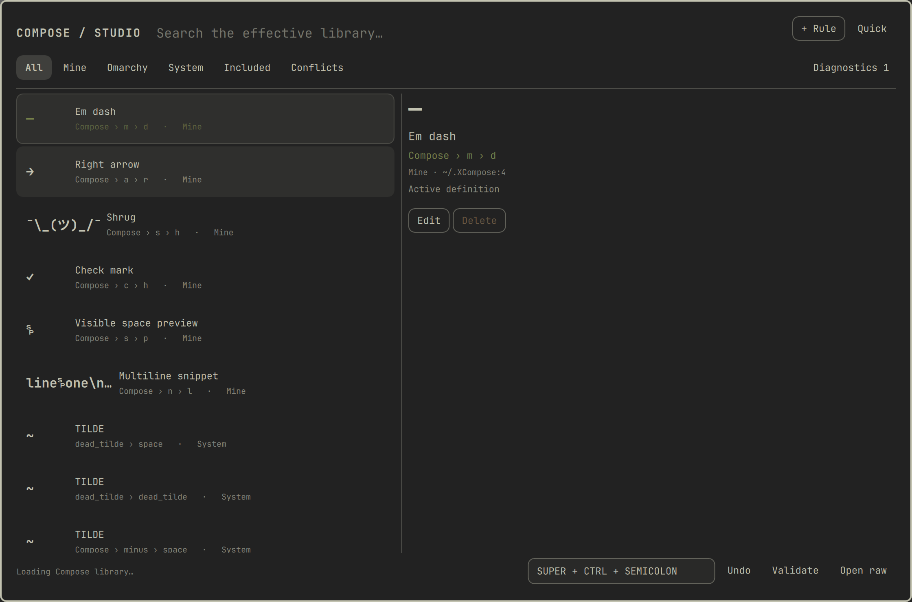

# Compose

> Your shortcuts for everything.

Compose makes XCompose approachable without replacing it. Press one shortcut to search every effective Compose rule, insert its exact result, or expand into a safe editor for `~/.XCompose`.



## What it does

- **Quick** is a keyboard-first picker for effective Compose rules. Search by output, label, sequence, keysym, or source; equivalent outputs are grouped under a preferred sequence, while outputs already covered by Omarchy's emoji picker stay out of the way. Studio retains every alternative. Press Enter to insert or Ctrl+Enter to copy.
- **Studio** browses Mine, Omarchy, System, Included, and conflicting rules. Local rules can be added, edited, deleted, and undone. Included rules stay read-only and expose a Create local override action.
- **Lossless editing** changes only the selected source span. Comments, spacing, ordering, line endings, includes, and syntax Compose does not own stay untouched.
- **Native behavior** keeps XCompose as the only expansion engine. Compose does not monitor global keystrokes, collect usage analytics, synchronize accounts, or make network requests.

## Install

```bash
omarchy plugin add https://github.com/melonamin/omarchy-compose.git --enable
```

The plugin is source-only. Runtime requirements are Bash 5, coreutils, `hyprctl`, `omarchy-shell`, `wl-copy`, `wtype`, `systemctl`, and Omarchy's supervised `fcitx5` service. Node is required only for tests.

Remove it with:

```bash
omarchy plugin remove melonamin.compose
```

Removal unregisters the live shortcut. Compose never edits `hyprland.lua` or any other Hyprland configuration file.

## Use

The default shortcut is `Super + Ctrl + ;`. It opens Quick with search focused:

- Type to search.
- Up/Down selects a rule.
- Enter closes Compose and inserts the exact decoded output into the previously focused application.
- Ctrl+Enter copies without typing.
- Escape clears the query first, then closes.
- Studio opens the full library and editor without losing the query or selection.

IPC fallbacks are always available:

```bash
omarchy-shell compose quick
omarchy-shell compose manage
omarchy-shell compose close
omarchy-shell compose status
```

`status` is deliberately redacted. It reports mode, open/dirty state, shortcut registration, revision, counts, diagnostics, and `fcitx5` health, but never Compose output.

## Shortcut settings and collisions

The setting lives inline on this plugin's entry in `~/.config/omarchy/shell.json`:

```json
{
  "plugins": [
    {
      "id": "melonamin.compose",
      "shortcut": "SUPER + CTRL + SEMICOLON"
    }
  ]
}
```

Edit it in Studio or in the JSON file. An empty string disables the binding. Compose detects when another Hyprland binding owns the requested chord and shows a collision diagnostic. It reinstalls the runtime binding after compositor reloads and does not write a default merely because the plugin loaded.

## Direct-file safety model

Rules stay in `${XCOMPOSEFILE:-~/.XCompose}`. Recursively included Omarchy, locale, system, and user files are searchable but read-only. Overriding one appends a later local rule to a marked section in the root file.

Before every save, Compose checks the exact file revision and refuses to overwrite an external edit. Writes use a same-directory temporary file, sync, and atomic rename. If the root is a symlink, Compose updates its final referent and leaves the symlink chain intact; broken, cyclic, or retargeted links are rejected.

Backups live under:

```text
${XDG_STATE_HOME:-~/.local/state}/omarchy-compose/backups/
```

Rejected candidates from a failed activation live under:

```text
${XDG_STATE_HOME:-~/.local/state}/omarchy-compose/rejected/
```

After a write, Compose runs `omarchy restart xcompose` and verifies `omarchy-fcitx5.service`. If activation fails, it retains the rejected candidate, atomically restores the previous bytes, retries activation once, and reports rollback health.

Studio's **Undo** restores the newest applicable backup through the same revision and activation guards. **Open raw** uses Omarchy's configured editor. **Validate** rescans without writing or restarting anything. If the root changes during an edit, Save is disabled until you reload; the raw draft can be copied first.

Manual recovery is also possible:

1. Close Studio so no draft is active.
2. Inspect the newest target-specific directory under `backups/` or a candidate under `rejected/`.
3. Copy the wanted content into the root Compose file or its symlink referent.
4. Run `omarchy restart xcompose`.
5. Confirm `systemctl --user is-active omarchy-fcitx5.service` reports `active`.

## Architecture

- `Service.qml` owns shared status, settings, IPC, health polling, and the runtime Hyprland shortcut.
- `Compose.qml` owns the adaptive Quick/Studio overlay, source state, editing, and subprocess boundaries.
- `ComposeModel.js` is the dependency-free lossless parser, effective-library resolver, search index, validation, and source-span transformation layer. The same file runs under QML and Node.
- `SourceLoader.qml` invokes the argument-safe source reader and rebuilds the recursive include graph.
- `scripts/compose-file` owns revision checks, backups, atomic persistence, activation, rollback, and Undo.
- `scripts/compose-insert` receives arbitrary UTF-8 over standard input, offers it through `wl-copy`, and uses the terminal-compatible Shift+Insert path.
- `hypr/compose.lua` registers and unregisters only the live shortcut through Hyprland's Lua runtime.

## Tests

Run the headless suite from the repository root:

```bash
tests/static.sh
node --test tests/*.test.js
tests/transaction.test.sh
```

Check live prerequisites, then run the explicit end-to-end test in an Omarchy/Hyprland session:

```bash
tests/integration.sh --check
tests/integration.sh --live
```

The live test temporarily exercises the real Compose file and plugin lifecycle. A trap restores the prior file and shell configuration byte-for-byte.
It also opens disposable `foot` and `zenity` fields to verify insertion into both terminal and GUI targets; those two programs are live-test-only dependencies.

## XCompose limitations

- Applications must use the active XCompose-capable input method. Some toolkits cache Compose tables until their input context is recreated.
- Existing applications may need focus changes or a restart after activation.
- A keysym-only result with no Unicode representation can be browsed but cannot be inserted by Quick.
- Prefix-related sequences conflict under libxkbcommon: the later definition remains active, and Studio reports which earlier rule it shadows.
- The fallback insertion path temporarily owns the clipboard; clipboard managers may retain the value according to their own policy.

## License

MIT
