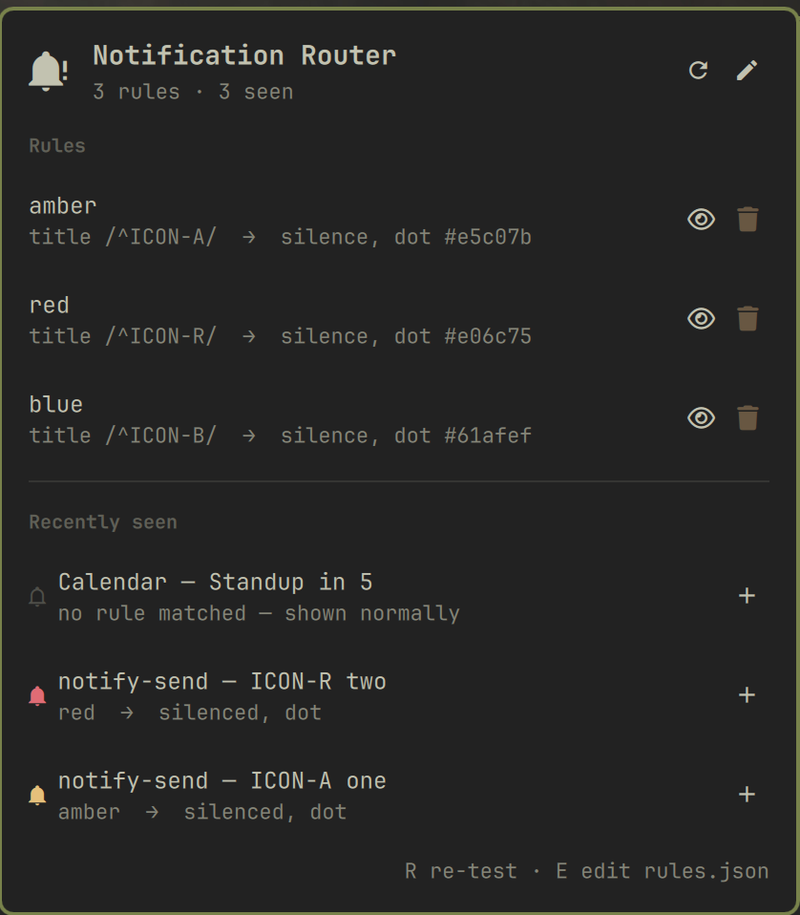

# Notification Router

A rule engine for Omarchy notifications. Match on app, title, body, or regex,
then silence, mark with a coloured bar dot, play a sound, or forward to
[ntfy](https://ntfy.sh) or a webhook.

Omarchy has several notification centres, and they all render the same
undifferentiated firehose. It also has plugins that each hardcode exactly one
rule — mute during screen share, play a sound, hide while presenting. This is
the missing layer underneath all of them: one place to say *which* notification
gets *what* treatment.



## Install

```bash
omarchy plugin add https://github.com/melonamin/omarchy-notification-router.git --enable --yes
```

Then write some rules:

```bash
mkdir -p ~/.config/omarchy/notification-router
cp ~/.config/omarchy/plugins/melonamin.notification-router/rules.example.json \
   ~/.config/omarchy/notification-router/rules.json
```

The file hot-reloads on save. Nothing to restart.

## Rules

`~/.config/omarchy/notification-router/rules.json`

```json
{
  "rules": [
    {
      "name": "Slack DMs go to my phone",
      "match": { "app": "Slack", "summary": "/^DM from/i" },
      "then": [
        { "silence": true },
        { "dot": "#e5c07b" },
        { "ntfy": { "topic": "my-topic", "priority": 4 } }
      ]
    }
  ]
}
```

### Matching

`match` takes any of `app`, `summary` (aliased as `title`), `body`, and
`urgency`. **Every** clause has to hold for the rule to fire; an empty `match`
block is a catch-all.

| Value form | Means |
|---|---|
| `"Slack"` | case-insensitive **substring** — catches `Slack` and `Slack — Ameba` |
| `"/^DM from/i"` | regex, with flags after the closing slash |
| `"urgency": "critical"` | one of `low`, `normal`, `critical` |

A rule whose regex does not compile is **dropped**, never widened — a typo must
never turn into a catch-all that silences everything. The panel shows you which
rule failed and why.

### Actions

| Action | Example | Notes |
|---|---|---|
| `silence` | `{"silence": true}` | The toast is never drawn. Still recorded in omarchy's history. |
| `dot` | `{"dot": "#e5c07b"}` | A bell in this colour in the bar, until acknowledged. |
| `sound` | `{"sound": "message-new-instant"}` | A path, or a name from the freedesktop sound theme. |
| `ntfy` | `{"ntfy": "my-topic"}` | Or `{topic, server, priority, title, message, tags, click, token}`. |
| `webhook` | `{"webhook": "https://…"}` | Or `{url, method, headers, body, json}`. `"json": {}` forwards the whole notification. |

Rules are evaluated **in order** and all matching rules contribute:

- `silence`, `dot`, and `sound` — the **last** matching rule wins. This is how
  you silence a whole app and then rescue one kind of message from it with
  `{"silence": false}` in a later rule.
- `ntfy` and `webhook` — these **accumulate**, so one notification can fan out
  to several places.
- `"stop": true` on a rule ends the pass there.
- `"enabled": false` skips a rule without deleting it.

### Templates

`{app}`, `{summary}` (or `{title}`), `{body}`, and `{urgency}` expand inside any
sink string, at any depth:

```json
{ "ntfy": { "topic": "alerts", "message": "{app}: {summary} — {body}" } }
```

## The bar

The widget shows one bell per routed notification, tinted by the rule that
caught it. At rest it is a dim routing glyph — the router is watching, nothing
is pending.

| Interaction | Does |
|---|---|
| hover a bell | shows the notification and which rule routed it |
| left-click a bell | runs its action if it has one, then clears it |
| middle-click | clears every bell |
| right-click | opens the panel |

Beyond `maxDots` (default 5) the rest collapse into a `+N` badge so a
notification storm cannot push the clock off the bar.

## The panel

Lists your rules with what each one matches and does, and — more usefully —
the notifications that recently went past with the verdict each one got. That
is the part a text editor cannot give you: you can see whether a regex actually
catches what you meant before you rely on it.

Rules can be toggled and deleted there, and `+` on a recent notification drafts
a rule matching that app so you don't have to guess at its exact `app` string.
Anything past that, edit the file — `E` opens it in `$EDITOR`.

## IPC

```bash
omarchy-shell notification-router status    # attached?, rule count, parse errors
omarchy-shell notification-router pending   # the dots currently showing
omarchy-shell notification-router test      # verdicts for recently-seen notifications
omarchy-shell notification-router clear     # clear the dots
omarchy-shell notification-router reload    # re-read rules.json
omarchy-shell notification-router explain "Slack" "DM from Anna" "lunch?"
```

`explain` is a dry run — it reports what the current rules *would* do to a
notification without sending one. It is the fastest way to answer "why did that
get silenced".

## How it works

The shell's first-party `omarchy.notifications` plugin owns the
`org.freedesktop.Notifications` D-Bus name, and only one process can. So the
router does not replace it, fork it, or race it for the name. It attaches to
the public `popupModel` and acts inside the model's own `rowsInserted` handler.

A row removed there is gone before control returns to the event loop, so the
notification's Wayland surface is never mapped and never composited. Silencing
is exact rather than a race — `tests/integration.sh` asserts this at the
compositor level by watching Hyprland's `openlayer` events. Removal uses
*expire* rather than *dismiss* semantics, so the sending application is told
the notification timed out rather than that you waved it away; chat clients
treat those very differently.

Nothing in this plugin patches or shadows omarchy's own code, so it survives
`omarchy update` untouched.

Sinks are built as argv arrays and executed without a shell. Notification
bodies are attacker-influenced text — a chat message can say anything — and
they end up inside ntfy messages and webhook payloads. There is no
`bash -c` anywhere in the path.

## Limitations

- **`colour` means the bar bell, not the toast.** The stock notification card
  derives its accent from urgency alone through a `readonly` property, so a
  per-rule toast colour is not reachable without forking the notification
  plugin. A bell in the bar is arguably the better trade anyway: a toast is
  gone in eight seconds, a bell waits until you acknowledge it.
- **Do Not Disturb hides notifications from the router.** Under DND the
  notification service writes straight to history without ever touching
  `popupModel`, so rules do not run and sinks do not fire.
- **Bells do not survive a shell restart.** They are in-memory acknowledgement
  markers; the notifications themselves are still in omarchy's history.
- **Clicking a bell can only replay omarchy's own actions.** Omarchy's toasts
  carry their action as an `exec` hint that outlives the notification. A
  third-party app's libnotify action does not survive being silenced.

## Tests

```bash
node --test tests/*.test.js   # rule engine, sinks, editing — no shell needed
tests/integration.sh          # end-to-end against the running shell
```

The rule engine and sink argv construction are plain JavaScript with no Qt
dependencies precisely so they can run under `node --test`.

## Licence

MIT
